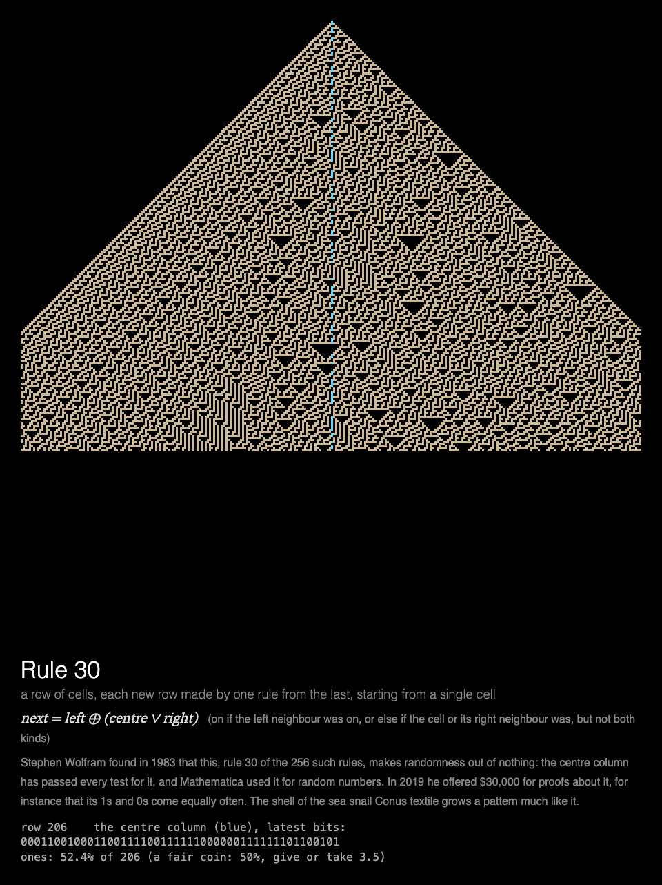

# MMM-Rule30

A [MagicMirror²](https://magicmirror.builders/) module that grows Wolfram's rule 30 from a single cell, a row at a time: one simple rule, regular on the left and random on the right.



## What you see

**Rule 30.** A row of cells, each new row made from the last by one rule, drawn a row at a time
from a single cell at the top: regular on the left, random on the right. The centre column is
drawn in blue. Five rows a second, so a 900 px canvas fills in a minute; then it rests.

Under the pattern: the rule, what it says in words, and a note on its history. The readout keeps
the centre column's latest bits and how often it has been 1, against the 50% a fair coin would
give and how far from it chance alone would stray.

Built for a **Raspberry Pi 3 without GPU acceleration**: everything is drawn by the CPU, each
frame adds one strip of the picture, the module rests once the canvas is full, and the animation
stops while the module is hidden (see [Performance](#performance)).

## Installation

```bash
cd ~/MagicMirror/modules
git clone https://github.com/charleswest775/MMM-Rule30
```

No npm dependencies: there is nothing to install.

## Update

```bash
cd ~/MagicMirror/modules/MMM-Rule30
git pull
```

## Configuration

```js
{
	module: "MMM-Rule30",
	position: "middle_center",
	config: {
		cycleSeconds: 600,  // start again from one cell this often
		width: 900,
		height: 900,
		fps: 20
	}
},
```

| Option | Default | Description |
|---|---|---|
| `cycleSeconds` | `60` | Start again from a single cell this often; it also starts again each time the module is shown again |
| `width`, `height` | `900` | Canvas size in pixels. Cells are 3 px, so the height sets the number of rows (300 for 900 px, a minute's growth) |
| `fps` | `20` | Frame-rate cap |
| `showMath` | `true` | Equations and live numbers under the canvas |
| `turns` | `null` | Take turns with other modules on the same page, e.g. `{ of: 2, at: 1 }` (see [Taking turns](#taking-turns)) |
| `statsPanel` | `false` | A line under the math showing what the mirror spends: fps, CPU of Electron and the compositor, a bar per core, temperature. Sampled by the module's `node_helper` from `/proc`, only while the module is shown |
| `debugStats` | `false` | Show achieved fps and per-frame timings in the corner of the screen |

## Taking turns

With `turns: { of: n, at: k }`, modules on the same [MMM-pages](https://github.com/edward-shen/MMM-pages)
page each show on their own one in n showings of it: `at: 0` on the first showing and every
nth after it, `at: 1` on the second, and so on. A module that isn't on its turn takes no room on
the page and costs nothing: it hides its canvas and doesn't start. So one slot in the rotation
can hold several pages, without making the rotation longer. For example, two ways to chaos from
a simple rule, one per showing: [MMM-LogisticMap](https://github.com/charleswest775/MMM-LogisticMap)'s
road to chaos and rule 30:

```js
{
	module: "MMM-LogisticMap",
	classes: "page-chaos",
	position: "middle_center",
	config: { turns: { of: 2, at: 0 } }
},
{
	module: "MMM-Rule30",
	classes: "page-chaos",
	position: "middle_center",
	config: { turns: { of: 2, at: 1 } }
},
{
	module: "MMM-pages",
	config: { modules: [["page-clock"], ["page-chaos"]], rotationTime: 60000 }
},
```

Without `turns` the module shows every time. It works just as well on a page of its own, or in
a normal region without MMM-pages, where it starts again every `cycleSeconds`.

## What's real

Wolfram's elementary cellular automaton number 30 (1983), exactly: a row of cells, each on or
off, and each new row made from the last by

    new = left XOR (centre OR right)

so a cell is on if its left neighbour was on, or else if it or its right neighbour was, but not
both. From one cell it grows a pattern regular on the left and random-looking on the right,
whose centre column has passed every test of randomness tried on it: Mathematica used it to make
random numbers. In 2019 Wolfram offered $30,000 for proofs about it, for instance that its 1s and
0s come equally often.

The rows are computed on a line wide enough that the pattern, growing a cell a row each way,
never reaches its ends, so what's shown is as on an endless line (`simulations/rule30.js`).

The tests check the first rows, the centre column's first 32 bits against OEIS A051023, that
over 20,000 rows it is 1 within a percent of half the time, and that the module draws exactly
its 300 rows, one centre bit each, in a minute, and then rests.

## Performance

Measured on a Raspberry Pi 3 B+ (Electron 42, software rendering), 900×900 at 20 fps, as CPU of
the Electron processes plus the `cage` compositor, in % of one core (the Pi has four); baseline
mirror without the module: 0.2%.

| | % of one core | achieved fps |
|---|---|---|
| module **hidden** (e.g. another MMM-pages page) | 0.3 | 0 |
| over a 60 s showing | 28 | 20 |

Why it costs so little, from micro-benchmarks on the Pi:

- There is no GPU acceleration to be had (the Pi 3's GPU only does GLES 2.0; Chromium needs
  3.0), so every pixel is drawn by the CPU.
- Any frame that changes the canvas costs ~2% of a core per fps, before drawing anything.
- On top of that, cost grows with the **area that changes**: Chromium redraws the bounding box
  of everything touched in a frame. Rule 30 only ever adds a row, so each frame changes one
  thin strip of the canvas.
- JavaScript is not the bottleneck (under 3 ms a frame).
- The frame loop sleeps with `setTimeout` until a frame is due, capped at `fps`. Once the canvas
  is full the module rests, and is only polled twice a second. While MagicMirror² fades the
  module out, nothing new is drawn; once it is hidden, the loop stops.

## Development

```bash
node --test                  # rule 30 checks (no dependencies)
python3 -m http.server       # then open http://localhost:8000/dev/preview.html
```

`dev/preview.html` runs the module outside MagicMirror², in a portrait 1200×1920 frame, with
hide/show buttons that follow MagicMirror²'s suspend/resume order. Query options override the
config, e.g. `?height=1200` for 400 rows, `?fps=30` or `?statsPanel=true`.

## License

MIT

Part of a family of MagicMirror² modules. Chaos, one simulation each:
[MMM-LorenzAttractor](https://github.com/charleswest775/MMM-LorenzAttractor),
[MMM-DoublePendulum](https://github.com/charleswest775/MMM-DoublePendulum),
[MMM-FractalBasins](https://github.com/charleswest775/MMM-FractalBasins),
[MMM-LogisticMap](https://github.com/charleswest775/MMM-LogisticMap),
[MMM-SymmetricIcons](https://github.com/charleswest775/MMM-SymmetricIcons),
[MMM-ThreeBody](https://github.com/charleswest775/MMM-ThreeBody) and
[MMM-ChaoticBilliards](https://github.com/charleswest775/MMM-ChaoticBilliards), or all eight in
one module, [MMM-ChaosTheory](https://github.com/charleswest775/MMM-ChaosTheory).
And more pages of physics and mathematics:
[MMM-Atom](https://github.com/charleswest775/MMM-Atom),
[MMM-FractalZoom](https://github.com/charleswest775/MMM-FractalZoom),
[MMM-Chladni](https://github.com/charleswest775/MMM-Chladni),
[MMM-SacredGeometry](https://github.com/charleswest775/MMM-SacredGeometry),
[MMM-Tilings](https://github.com/charleswest775/MMM-Tilings),
[MMM-PlanetsDance](https://github.com/charleswest775/MMM-PlanetsDance),
[MMM-SnowCrystal](https://github.com/charleswest775/MMM-SnowCrystal) and
[MMM-NightSky](https://github.com/charleswest775/MMM-NightSky).
